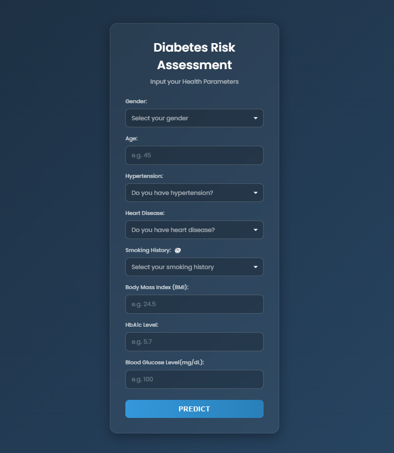
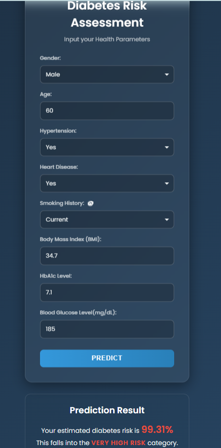

# Diabetes Risk Assessment system


Machine learning web application that predicts the probability
of diabetes risk using demographic and clinical indicators.
The system uses a CatBoost classifier and provides predictions
through a Flask-based web interface.

### Dataset Source
This project uses the "Diabetes Prediction Dataset" from Kaggle:
- URL: [dataset](https://www.kaggle.com/datasets/iammustafatz/diabetes-prediction-dataset)
- Review the dataset page for licensing/terms of use before redistribution.

To (re)train the model, download the dataset into the Data/ directory. 

### Technical Overview

- **Framework:** Flask
- **Model:** CatBoostClassifier
- **Dataset:** ~100,000 patient records
- **Python:** 3.9+

**Features Used**
- Gender
- Age
- Hypertension
- Heart Disease
- Smoking History
- BMI
- HbA1c
- Blood Glucose Level

**Training Setup**
- Train/Test Split: 80/20 (stratified)
- Evaluation Metric: AUC
- Threshold tuning: 0.5 → 0.3
- Output: Probability-based risk estimation

### Model Performance

| Metric | Value |
|------|------|
Accuracy | 96.8%
AUC | 97.98%
Precision (Diabetic) | 0.86
Recall (Diabetic) | 0.75

- The decision threshold was lowered from 0.5 to 0.3 to improve recall, prioritizing detection of high-risk individuals. This slightly reduced precision but made the model more suitable as a screening tool.

## Reproduce Results

1. Download dataset
2. Train model
3. Start web app

python Training/CatBoost_Model_Training.py
python app.py

### Risk Classification Logic
- < 30% → Low Risk
- 30-59% → Moderate Risk
- 60-79% → High Risk
- ≥ 80% → Very High Risk

### Project Structure
Diabetes_Prediction/
│
├── Data/
│   └── diabetes_prediction_dataset.csv
├── docs/
|   └── ui_form.png
|   └── prediction_result.png
|
├── Evaluation/
│   ├── classification_report.txt
│   ├── confusion_matrix.png
│   └── metrics.json
|
├── Model/
│   ├── diabetes_model.cbm
│   └── feature_columns.json
│
├── static/
|   └── style.css
|   └── script.js
|
├── templates/
│   └── index.html
|
├── Training/
|   └── CatBoost_Model_Training.py
│
├── app.py
├── CONTRIBUTING.md
├── LICENSE
├── README.md
└── requirements.txt
 
### Quick Start
0. Prerequisites
   - Python 3.9+ and pip installed
   - (Optional) Git

1. Create a virtual environment
   - macOS/Linux:
     ```
     python3 -m venv .venv
     source .venv/bin/activate
     ```
   - Windows (PowerShell):
     ```
     py -3 -m venv .venv
     .\.venv\Scripts\Activate.ps1
     ```
2. Install dependencies:
   ```
   pip install -r requirements.txt
   ```
3. Train model (optional; a pre-trained model may already exist in Model/):
   ```
   python Training/CatBoost_Model_Training.py
   ```
   This will generate:
   - Model/diabetes_model.cbm
   - Model/feature_columns.json
   - Evaluation/metrics.json, 
   Evaluation/classification_report.txt, Evaluation/confusion_matrix.png

4. Start web server:
   ```
   python app.py
   ```
5. Open browser at:
   http://127.0.0.1:5000

### Demo

The application currently runs locally via Flask.

After launching the server, the web interface allows users to enter
clinical indicators and receive a predicted diabetes risk probability.

Steps to run:
1. Clone the repository
2. Install requirements
3. Run the model script

## Web Application Interface

### Input Form
The application provides a simple interface where users can enter
clinical and demographic indicators related to diabetes risk.



### Prediction Result
After submission, the system estimates the probability of diabetes
and returns a risk assessment generated by the trained CatBoost model.



### Usage
- Open the web app and provide the following inputs:
  - Gender
  - Age
  - Hypertension (0/1)
  - Heart Disease (0/1)
  - Smoking History (categorical)
  - BMI
  - HbA1c
  - Blood Glucose Level

### Model Artifacts
- Model/diabetes_model.cbm: Trained CatBoost model used by the Flask app.
- Model/feature_columns.json: Feature schema used to align training and inference (e.g., categorical feature handling).
Keep both files in sync with the Training script to prevent schema mismatches.

## Model Limitations, Ethical & Medical Disclaimer

This model is intended for educational and demonstration purposes only.
It should not be used for medical diagnosis.Users should consult licensed healthcare professionals for medical advice.
Additionally, do not use real personally identifiable information (PII). If using real clinical data, ensure compliance with applicable privacy laws and institutional policies.

Key limitations:

- The model is trained on a specific dataset and may not generalize to
  all populations.
- Predictions are probabilistic and should be interpreted as risk
  estimates rather than definitive outcomes.
- Clinical decisions should always be made by qualified medical
  professionals.


### Future Improvements
- Increase Recall further
- Calibrating probabilities
- Cross-validation
- External dataset validation
- Add SHAP 

### Contributing
Contributions, issues and feature requests are welcome. For larger changes, please open an issue to discuss what you would like to change. Consider following conventional commits and opening PRs against a feature branch.
